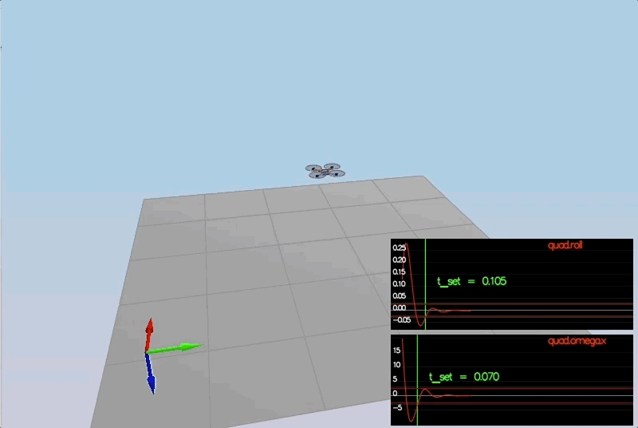

# Project: Quadrotor 3D Controller

## Required Steps for a Passing Submission:
1. Setup the [Udacity C++ simulator repository](https://github.com/udacity/FCND-Controls-CPP)
2. Complie and test the simulator
3. Adjust the `Mass` parameter in `QuadControlParams.txt` to make the vehicle stay in the same altitude.
4. Implement body rate control and tune `kpPQR` parameter in `QuadControlParams.txt` to get the vehicle to stop spinning quickly with no overshoot.
5. Implement roll/pitch control and tune `kpBank` in `QuadControlParams.txt` to minimize settling time with minimal overshoot.
6. Implement lateral position control and altitude control and tune `kpPosZ`, `kpPosZ`, `kpVelXY`, `kpVelZ` to get the vehicles to approximately reach to their destination points with some errors.
7. Implement yaw control and tune `kpYaw` and the 3rd component of `kpPQR` to minimize settling time.
8. Tweak the controller parameters to achieve robustness against some of the non-idealities of a controller.
9. Retune the controller parameters to get vehicle to track a trajectory.

## The Tasks ##

For this project, you will be building a controller in C++.  You will be implementing and tuning this controller in several steps.

You may find it helpful to consult the [Python controller code](https://github.com/udacity/FCND-Controls/blob/solution/controller.py) as a reference when you build out this controller in C++.

#### Notes on Parameter Tuning
1. **Comparison to Python**: Note that the vehicle you'll be controlling in this portion of the project has different parameters than the vehicle that's controlled by the Python code linked to above. **The tuning parameters that work for the Python controller will not work for this controller**

2. **Parameter Ranges**: You can find the vehicle's control parameters in a file called `QuadControlParams.txt`. The default values for these parameters are all too small by a factor of somewhere between about 2X and 4X. So if a parameter has a starting value of 12, it will likely have a value somewhere between 24 and 48 once it's properly tuned.

3. **Parameter Ratios**: In this [one-page document](https://www.overleaf.com/read/bgrkghpggnyc#/61023787/) you can find a derivation of the ratio of velocity proportional gain to position proportional gain for a critically damped double integrator system. The ratio of `kpV / kpP` should be 4.

### Body rate and roll/pitch control (scenario 2) ###
First, you will implement the body rate and roll / pitch control.  For the simulation, you will use `Scenario 2`.  In this scenario, you will see a quad above the origin.  It is created with a small initial rotation speed about its roll axis.  Your controller will need to stabilize the rotational motion and bring the vehicle back to level attitude.

To accomplish this, you will:

1. Implement body rate control

 - implement the code in the function `GenerateMotorCommands()`
 - implement the code in the function `BodyRateControl()`
 - Tune `kpPQR` in `QuadControlParams.txt` to get the vehicle to stop spinning quickly but not overshoot

If successful, you should see the rotation of the vehicle about roll (omega.x) get controlled to 0 while other rates remain zero.  Note that the vehicle will keep flying off quite quickly, since the angle is not yet being controlled back to 0.  Also note that some overshoot will happen due to motor dynamics!.

If you come back to this step after the next step, you can try tuning just the body rate omega (without the outside angle controller) by setting `QuadControlParams.kpBank = 0`.

2. Implement roll / pitch control
We won't be worrying about yaw just yet.

 - implement the code in the function `RollPitchControl()`
 - Tune `kpBank` in `QuadControlParams.txt` to minimize settling time but avoid too much overshoot

If successful you should now see the quad level itself (as shown below), though it’ll still be flying away slowly since we’re not controlling velocity/position!  You should also see the vehicle angle (Roll) get controlled to 0.

<p align="center">

</p>


### Position/velocity and yaw angle control (scenario 3) ###

Next, you will implement the position, altitude and yaw control for your quad.  For the simulation, you will use `Scenario 3`.  This will create 2 identical quads, one offset from its target point (but initialized with yaw = 0) and second offset from target point but yaw = 45 degrees.

 - implement the code in the function `LateralPositionControl()`
 - implement the code in the function `AltitudeControl()`
 - tune parameters `kpPosZ` and `kpPosZ`
 - tune parameters `kpVelXY` and `kpVelZ`

If successful, the quads should be going to their destination points and tracking error should be going down (as shown below). However, one quad remains rotated in yaw.

 - implement the code in the function `YawControl()`
 - tune parameters `kpYaw` and the 3rd (z) component of `kpPQR`

Tune position control for settling time. Don’t try to tune yaw control too tightly, as yaw control requires a lot of control authority from a quadcopter and can really affect other degrees of freedom.  This is why you often see quadcopters with tilted motors, better yaw authority!

<p align="center">

</p>

**Hint:**  For a second order system, such as the one for this quadcopter, the velocity gain (`kpVelXY` and `kpVelZ`) should be at least ~3-4 times greater than the respective position gain (`kpPosXY` and `kpPosZ`).

### Non-idealities and robustness (scenario 4) ###

In this part, we will explore some of the non-idealities and robustness of a controller.  For this simulation, we will use `Scenario 4`.  This is a configuration with 3 quads that are all are trying to move one meter forward.  However, this time, these quads are all a bit different:
 - The green quad has its center of mass shifted back
 - The orange vehicle is an ideal quad
 - The red vehicle is heavier than usual

1. Run your controller & parameter set from Step 3.  Do all the quads seem to be moving OK?  If not, try to tweak the controller parameters to work for all 3 (tip: relax the controller).

2. Edit `AltitudeControl()` to add basic integral control to help with the different-mass vehicle.

3. Tune the integral control, and other control parameters until all the quads successfully move properly.  Your drones' motion should look like this:

<p align="center">

</p>


### Tracking trajectories ###

Now that we have all the working parts of a controller, you will put it all together and test it's performance once again on a trajectory.  For this simulation, you will use `Scenario 5`.  This scenario has two quadcopters:
 - the orange one is following `traj/FigureEight.txt`
 - the other one is following `traj/FigureEightFF.txt` - for now this is the same trajectory.  For those interested in seeing how you might be able to improve the performance of your drone by adjusting how the trajectory is defined, check out **Extra Challenge 1** below!

How well is your drone able to follow the trajectory?  It is able to hold to the path fairly well?


### Extra Challenge 1 (Optional) ###

You will notice that initially these two trajectories are the same. Let's work on improving some performance of the trajectory itself.

1. Inspect the python script `traj/MakePeriodicTrajectory.py`.  Can you figure out a way to generate a trajectory that has velocity (not just position) information?

2. Generate a new `FigureEightFF.txt` that has velocity terms
Did the velocity-specified trajectory make a difference? Why?

With the two different trajectories, your drones' motions should look like this:

<p align="center">

</p>


### Extra Challenge 2 (Optional) ###

For flying a trajectory, is there a way to provide even more information for even better tracking?

How about trying to fly this trajectory as quickly as possible (but within following threshold)!


## Evaluation ##

To assist with tuning of your controller, the simulator contains real time performance evaluation.  We have defined a set of performance metrics for each of the scenarios that your controllers must meet for a successful submission.

There are two ways to view the output of the evaluation:

 - in the command line, at the end of each simulation loop, a **PASS** or a **FAIL** for each metric being evaluated in that simulation
 - on the plots, once your quad meets the metrics, you will see a green box appear on the plot notifying you of a **PASS**


### Performance Metrics ###

The specific performance metrics are as follows:

 - scenario 2
   - roll should less than 0.025 radian of nominal for 0.75 seconds (3/4 of the duration of the loop)
   - roll rate should less than 2.5 radian/sec for 0.75 seconds

 - scenario 3
   - X position of both drones should be within 0.1 meters of the target for at least 1.25 seconds
   - Quad2 yaw should be within 0.1 of the target for at least 1 second


 - scenario 4
   - position error for all 3 quads should be less than 0.1 meters for at least 1.5 seconds

 - scenario 5
   - position error of the quad should be less than 0.25 meters for at least 3 seconds

## Authors ##

Thanks to Fotokite for the initial development of the project code and simulator.

## [Rubric Points](https://review.udacity.com/#!/rubrics/1643/view)

## Writeup
### Provide a Writeup / README that includes all the rubric points and how you addressed each one. You can submit your write-up as markdown or pdf.

You're reading it! Below I describe how I addressed each rubric point and where in my code each point is handled.

## Implemented Controller

### Implemented body rate control in C++.

This part is implemented in [QuadControl::BodyRateControl](./cpp/src/QuadControl.cpp#L104-L105):

```cpp
V3F rateErr = pqrCmd - pqr;
momentCmd = V3F(Ixx,Iyy,Izz) * kpPQR * rateErr;
```
### Implement roll pitch control in C++.

This part is implemented in [QuadControl::RollPitchControl](./cpp/src/QuadControl.cpp#L134-L147):

```cpp
float targetBX = 0.0;
float targetBY = 0.0;
if (collThrustCmd > 0.0)
{
  float c = collThrustCmd/mass;
  targetBX = -CONSTRAIN(accelCmd.x/c, -maxTiltAngle, maxTiltAngle);
  targetBY = -CONSTRAIN(accelCmd.y/c, -maxTiltAngle, maxTiltAngle);
}
float bX = targetBX - R(0, 2);
float bY = targetBY - R(1, 2);

pqrCmd.x = kpBank *((R(1, 0) * bX) - (R(0, 0) * bY)) / R(2, 2);
pqrCmd.y = kpBank *((R(1, 1) * bX) - (R(0, 1) * bY)) / R(2, 2);
pqrCmd.z = 0.f;
```

### Implement altitude controller in C++.

This part is implemented in [QuadControl::AltitudeControl](./cpp/src/QuadControl.cpp#L177-L183):

```cpp
float zErr = posZCmd - posZ;
integratedAltitudeError += zErr * dt;

float velZRef = velZCmd + (kpPosZ * zErr) + (KiPosZ * integratedAltitudeError);
velZRef = -CONSTRAIN(-velZRef, -maxDescentRate, maxAscentRate);
float accelCmd = accelZCmd + (kpVelZ*(velZRef - velZ));
thrust = mass * (9.81f - (accelCmd / R(2,2)));
```

### Implement lateral position control in C++.

This part is implemented in [QuadControl::LateralPositionControl](./cpp/src/QuadControl.cpp#L219-L224):

```cpp
velCmd.constrain(-maxSpeedXY,maxSpeedXY);
V3F posErr = posCmd - pos;
V3F velErr = velCmd - vel;
accelCmd = accelCmdFF + (kpPosXY * posErr) + (kpVelXY * velErr); //z compent is zero, so let's ignore use kpPosXY/kpVelXY for pos.z/vel.z as well
accelCmd.constrain(-maxAccelXY,maxAccelXY);
accelCmd.z = 0;
```

### Implement yaw control in C++.

This part is implemented in [QuadControl::YawControl](./cpp/src/QuadControl.cpp#L245-L256):

```cpp
yawCmd = fmod(yawCmd, (2.0f*F_PI));

if (yawCmd <= -F_PI)
{
 yawCmd += (2.0f*F_PI);
}
else if (yawCmd > F_PI)
{
 yawCmd -= (2.0f*F_PI);
}

yawRateCmd = kpYaw * (yawCmd - yaw);
```

### Implement calculating the motor commands given commanded thrust and moments in C++.

This part is implemented in [QuadControl::GenerateMotorCommands](./cpp/src/QuadControl.cpp#L72-L81):

```cpp
float l = L / sqrtf(2.f);
float cBar = collThrustCmd / 4.f;
float pBar = momentCmd.x / (l * 4.f);
float qBar = momentCmd.y / (l * 4.f);
float rBar = momentCmd.z / (kappa * 4.f);

cmd.desiredThrustsN[0] = cBar + pBar + qBar + rBar; // front left
cmd.desiredThrustsN[1] = cBar - pBar + qBar - rBar; // front right
cmd.desiredThrustsN[2] = cBar + pBar - qBar - rBar; // rear left
cmd.desiredThrustsN[3] = cBar - pBar - qBar + rBar; // rear right
```

## Flight Evaluation

### Your C++ controller is successfully able to fly the provided test trajectory and visually passes inspection of the scenarios leading up to the test trajectory.

The results are displayed above and can be found in  folder. The implementation passes scenarios 1 to 5:

```
# Scenario 1
PASS: ABS(Quad.PosFollowErr) was less than 0.500000 for at least 0.800000 seconds
# Scenario 2
PASS: ABS(Quad.Roll) was less than 0.025000 for at least 0.750000 seconds
PASS: ABS(Quad.Omega.X) was less than 2.500000 for at least 0.750000 seconds
# Scenario 3
PASS: ABS(Quad1.Pos.X) was less than 0.100000 for at least 1.250000 seconds
PASS: ABS(Quad2.Pos.X) was less than 0.100000 for at least 1.250000 seconds
PASS: ABS(Quad2.Yaw) was less than 0.100000 for at least 1.000000 seconds
# Scenario 4
PASS: ABS(Quad1.PosFollowErr) was less than 0.100000 for at least 1.500000 seconds
PASS: ABS(Quad2.PosFollowErr) was less than 0.100000 for at least 1.500000 seconds
PASS: ABS(Quad3.PosFollowErr) was less than 0.100000 for at least 1.500000 seconds
# Scenario 5
PASS: ABS(Quad2.PosFollowErr) was less than 0.250000 for at least 3.000000 seconds
```
