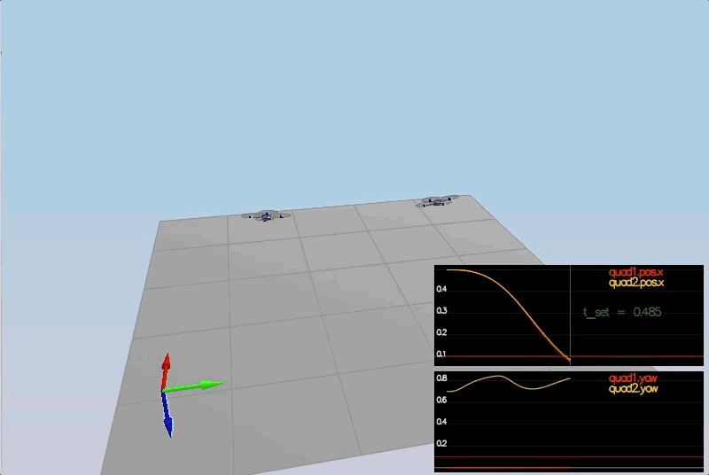
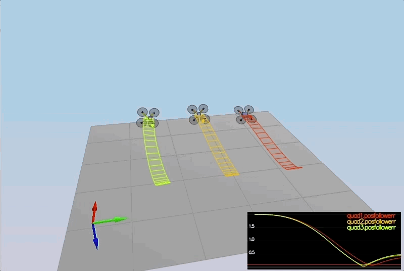

# Project: Quadrotor 3D Controller

## Required Steps for a Passing Submission:
1. Setup the [Udacity C++ simulator repository](https://github.com/udacity/FCND-Controls-CPP)
2. Complie and test the simulator
3. Adjust the `Mass` parameter in `QuadControlParams.txt` to make the vehicle stay in the same altitude.
4. Implement body rate control and tune `kpPQR` parameter in `QuadControlParams.txt` to get the vehicle to stop spinning quickly with no overshoot.
5. Implement roll/pitch control and tune `kpBank` in `QuadControlParams.txt` to minimize settling time with minimal overshoot.
6. Implement lateral position control and altitude control and tune `kpPosZ`, `kpPosZ`, `kpVelXY`, `kpVelZ` to get the vehicles to approximately reach to their destination points with some errors.
7. Implement yaw control and tune `kpYaw` and the 3rd component of `kpPQR` to minimize settling time.
8. Tweak the controller parameters to achieve robustness against some of the non-idealities of a controller.
9. Retune the controller parameters to get vehicle to track a trajectory.

## The Tasks ##

For this project, you will be building a controller in C++.  You will be implementing and tuning this controller in several steps.

You may find it helpful to consult the [Python controller code](https://github.com/udacity/FCND-Controls/blob/solution/controller.py) as a reference when you build out this controller in C++.

#### Notes on Parameter Tuning
1. **Comparison to Python**: Note that the vehicle you'll be controlling in this portion of the project has different parameters than the vehicle that's controlled by the Python code linked to above. **The tuning parameters that work for the Python controller will not work for this controller**

2. **Parameter Ranges**: You can find the vehicle's control parameters in a file called `QuadControlParams.txt`. The default values for these parameters are all too small by a factor of somewhere between about 2X and 4X. So if a parameter has a starting value of 12, it will likely have a value somewhere between 24 and 48 once it's properly tuned.

3. **Parameter Ratios**: In this [one-page document](https://www.overleaf.com/read/bgrkghpggnyc#/61023787/) you can find a derivation of the ratio of velocity proportional gain to position proportional gain for a critically damped double integrator system. The ratio of `kpV / kpP` should be 4.

### Body rate and roll/pitch control (scenario 2) ###
After implementation, scenario 2 performances like this:

### Position/velocity and yaw angle control (scenario 3) ###

The quads are going to their destination points and tracking error is going down.

### Non-idealities and robustness (scenario 4) ###

All the quads successfully move properly. 

### Tracking trajectories ###

Now that we have all the working parts of a controller, you will put it all together and test it's performance once again on a trajectory.  For this simulation, you will use `Scenario 5`.  This scenario has two quadcopters:
 - the orange one is following `traj/FigureEight.txt`
 - the other one is following `traj/FigureEightFF.txt` - for now this is the same trajectory.  For those interested in seeing how you might be able to improve the performance of your drone by adjusting how the trajectory is defined, check out **Extra Challenge 1** below!

How well is your drone able to follow the trajectory?  It is able to hold to the path fairly well?

### Extra Challenge 1 (Optional) ###

1. Inspect the python script `traj/MakePeriodicTrajectory.py`.  Can you figure out a way to generate a trajectory that has velocity (not just position) information?

2. Generate a new `FigureEightFF.txt` that has velocity terms
Did the velocity-specified trajectory make a difference? Why?

With the two different trajectories, drones' motions:

### Performance Metrics ###

The specific performance metrics are as follows:

 - scenario 2
   - roll should less than 0.025 radian of nominal for 0.75 seconds (3/4 of the duration of the loop)
   - roll rate should less than 2.5 radian/sec for 0.75 seconds

 - scenario 3
   - X position of both drones should be within 0.1 meters of the target for at least 1.25 seconds
   - Quad2 yaw should be within 0.1 of the target for at least 1 second

 - scenario 4
   - position error for all 3 quads should be less than 0.1 meters for at least 1.5 seconds

 - scenario 5
   - position error of the quad should be less than 0.25 meters for at least 3 seconds

## Authors ##

Thanks to Fotokite for the initial development of the project code and simulator.

## [Rubric Points](https://review.udacity.com/#!/rubrics/1643/view)

## Writeup
### Provide a Writeup / README that includes all the rubric points and how you addressed each one. You can submit your write-up as markdown or pdf.

You're reading it! Below I describe how I addressed each rubric point and where in my code each point is handled.

## Implemented Controller

### Implemented body rate control in C++.

This part is implemented in QuadControl.cpp, Line 106 and onwards.
The body rate control takes three input commands, then returns moment command, updated by three parameters, error rate and gain parameter.

### Implement roll pitch control in C++.

This part is implemented in QuadControl.cpp, line 138 and onward.

    float target_bx = 0.0;
    float target_by = 0.0;
    if (collThrustCmd > 0.0){
        float c = collThrustCmd/mass;
        target_bx = -CONSTRAIN(accelCmd.x/c, -maxTiltAngle, maxTiltAngle);
        target_by = -CONSTRAIN(accelCmd.y/c, -maxTiltAngle, maxTiltAngle);
    }
    float bx = target_bx - R(0, 2);
    float by = target_by - R(1, 2);
    
    pqrCmd.x = kpBank * ((R(1,0) * bx) - (R(0, 0) * by)) / R(2,2);
    pqrCmd.y = kpBank * ((R(1,1) * bx) - (R(0, 1) * by)) / R(2,2);

### Implement altitude controller in C++.

This part is implemented in QuadControl.cpp, line 181 and onward.

    float z_err = posZCmd - posZ;
    integratedAltitudeError += z_err * dt;
    
    float vel_z = velZCmd + (kpPosZ * z_err) + (KiPosZ * integratedAltitudeError);
    vel_z = -CONSTRAIN(-vel_z, -maxDescentRate, maxAscentRate);
    float accelCmd = accelZCmd + (kpVelZ * (vel_z - velZ));
    thrust = mass * (9.81f - (accelCmd / R(2, 2)));

### Implement lateral position control in C++.

This part is implemented in QuadControl.cpp, line 224 and onward.

    velCmd.constrain(-maxSpeedXY, maxSpeedXY);
    V3F pos_err = posCmd - pos;
    V3F vel_err = velCmd - vel;
    accelCmd = accelCmdFF + (kpPosXY * pos_err) + (kpVelXY * vel_err);
    accelCmd.constrain(-maxAccelXY, maxAccelXY);
    accelCmd.z = 0;
    
### Implement yaw control in C++.

This part is implemented in QuadControl.cpp, line 251 and onward. 

    yawCmd = fmod(yawCmd, (2.0f * F_PI));
    if(yawCmd <= - F_PI){
        yawCmd += (2.0f * F_PI);
    }
    else if (yawCmd > F_PI){
        yawCmd -= (2.0f * F_PI);
    }

### Implement calculating the motor commands given commanded thrust and moments in C++.

This part is implemented in uadControl.cpp, line 72 and onward. 

    float l = L/sqrtf(2.f);
    float c_bar = collThrustCmd/4.f;
    float p_bar = momentCmd.x / (l * 4.f);
    float q_bar = momentCmd.y / (l * 4.f);
    float r_bar = momentCmd.z / (kappa * 4.f);
    
    
    cmd.desiredThrustsN[0] = c_bar + p_bar + q_bar + r_bar; // front left
    cmd.desiredThrustsN[1] = c_bar - p_bar + q_bar - r_bar; // front right
    cmd.desiredThrustsN[2] = c_bar + p_bar - q_bar - r_bar; // rear left
    cmd.desiredThrustsN[3] = c_bar - p_bar - q_bar + r_bar;  // rear right

## Flight Evaluation

### Your C++ controller is successfully able to fly the provided test trajectory and visually passes inspection of the scenarios leading up to the test trajectory.

The results are gif above, all criterials are met. 
