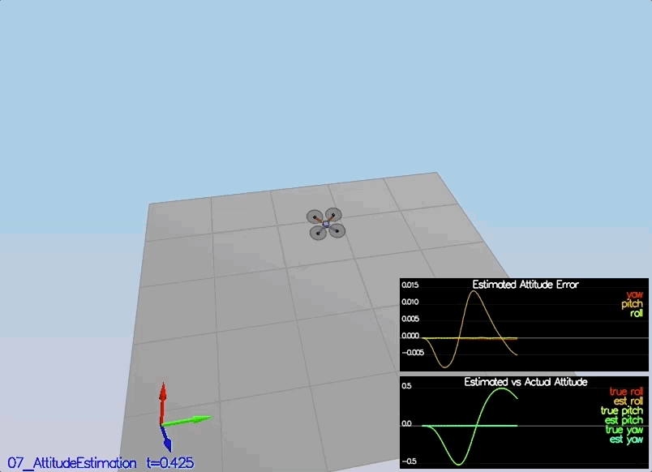
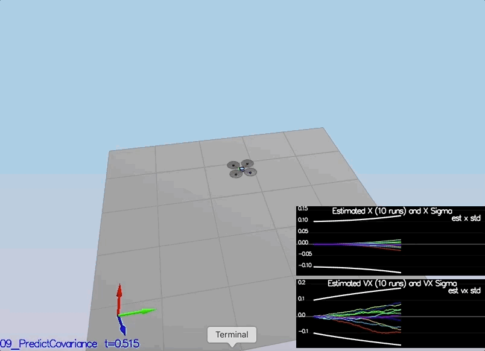

# Project: Estimation

## Project description

The main task in this project is to implement an estimator for quadrotors to deal with realistic and noisy sensors
using [Extended Kalman Filter(EKF)](https://en.wikipedia.org/wiki/Extended_Kalman_filter) and fusing gyro, IMU, gps, and magnetometer signals to get
an estimate of position, velocity, and yaw angle.

## Required Steps for a Passing Submission:

1. Make sure you have cloned the repository and gotten familiar with the additional project repository files Introduction.
2. Implement all the necessary update and prediction steps required for your estimator to meet all the performance criteria of each step, outlined in detail in the project [README](https://github.com/udacity/FCND-Estimation-CPP/blob/master/README.md)
3. Tune your estimator, and re-tune your controller from your controls C++ project to successfully fly the desired trajectory with realistic sensors

## File description
- [QuadEstimatorEKF.txt](./config/QuadEstimatorEKF.txt): This files contains the estimator parameters.
- [QuadEstimatorEKF.cpp](./src/QuadEstimatorEKF.cpp): This file contains the estimator implementation. The original file with placeholders for the EKF implementaion was provided by Udacity. 
- [QuadControlParams.txt](./config/QuadControlParams.txt): This file contains the configuration for the controller. The parameters are re-tuned to work successfully with the estimator.
- [QuadControl.cpp](./src/QuadControl.cpp): This file contains the implementation of the controller by Udacity. 
- [Graph1.txt](./config/log/Graph1.txt): This is a log file containing `Quad.GPS.X` measurements.
- [Graph2.txt](./config/log/Graph2.txt): This is a log file containing `Quad.IMU.AX` measurements.

## Tasks results

### Step 1: Sensor Noise

### Step 2: Attitude Estimation

### Step 3: Prediction Step

Prediction Covariance.

### Step 4: Magnetometer Update

### Step 5: Closed Loop + GPS Update

### Step 6: Adding Your Controller

